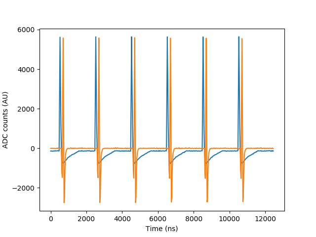
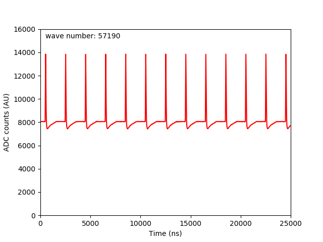
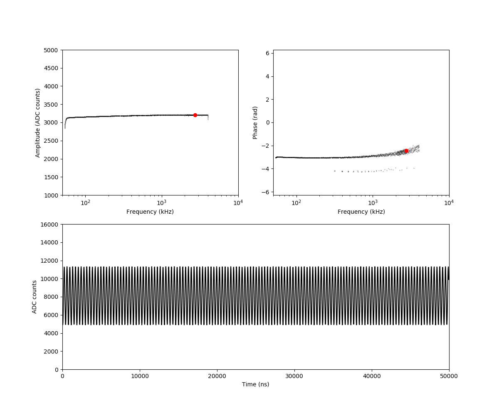

# Cyclone V GX Starter Kit with Data Conversion Card

## Description

This repository contains a Quartus project which programs a Cyclone V GX starter kit with a data conversion board to act as a data acquisition system which communicates with a PC via UART. It is an R&D project for ATLAS

Information on the Cyclone V GX starter kit can be found [here](https://www.altera.com/solutions/partners/partner-profile/terasic-inc-/board/cyclone-v-gx-starter-kit.html)

Information on the Data Conversion Card can be found [here](https://www.terasic.com.tw/cgi-bin/page/archive.pl?Language=English&No=360)

The Quartus project is written in verilog.

## Scripts

There are several python scripts which can be used to recieve waveforms from the Cyclone V board. All scripts require these packages:

* pyserial
* matplotlib
* numpy

The scripts can be found in the scripts/ subdirectory.

The scripts will attempt to open lpm_pll.v to read the clock frequency. This can be overridden with the '-r' parameter

### getData.py and getData_FIR.py

These scripts retrieve a waveform from the Cyclone V. Command line settings are the same for both getData.py and getData_FIR.py.

getData.py gets just the waveform, while getData_FIR.py gets the waveform and the FIR response.

    usage: getData.py [-h] [-p PORT] [-s] [-f FILENAME] [-n] [-r FREQ]

    View a single waveform coming from UART

    optional arguments:
      -h, --help            show this help message and exit
      -p PORT, --port PORT  The port to listen to
      -s, --save            Save data to a file
      -f FILENAME, --filename FILENAME
                            Name of data file
      -n, --noGraph         Suppress graphical output
      -r FREQ, --freq FREQ  Sampling frequency in Megahertz (default: 40.0)

Example output for getData_FIR.py:

### slowScope.py and slowScope_FIR.py

These scripts will show waveforms from the Cyclone V as they come in, acting as an oscilloscope.

As before, slowScope.py gets just the waveform, while slowScope_FIR.py gets the waveform and the FIR response.

    usage: slowScope.py [-h] [-p PORT] [-m] [-f FILENAME] [-t TIMEOUT] [-r FREQ]

    View waveforms coming from UART

    optional arguments:
      -h, --help            show this help message and exit
      -p PORT, --port PORT  The port to listen to
      -m, --movie           Save a 200 frame video
      -f FILENAME, --filename FILENAME
                            Video filename
      -t TIMEOUT, --timeout TIMEOUT
                            Port timeout (controls update rate)
      -r FREQ, --freq FREQ  Sampling frequency in Megahertz (default: 40.0)

Example output for slowScope.py:

### Amplitude_Phase.py

This script calculates the amplitude, phase, and frequency of a sine wave, and plots amplitude and phase against frequency. It is best used with a logarithmic frequency scanned sine wave.

    usage: Amplitude_Phase.py [-h] [-p PORT] [-m] [-f FILENAME] [-t TIMEOUT]
                          [-r FREQ] [-d]

    Find amplitude and phase of sinewave from FPGA

    optional arguments:
      -h, --help            show this help message and exit
      -p PORT, --port PORT  The port to listen to
      -m, --movie           Save a video
      -f FILENAME, --filename FILENAME
                            Video filename
      -t TIMEOUT, --timeout TIMEOUT
                            Port timeout (controls update rate)
      -r FREQ, --freq FREQ  Sampling frequency in Megahertz (default: 40.0)
      -d, --delay           Send delay signal before starting, resend after

Example output:

### sendChar.py

This script sends a character to the Cyclone V. It can be used to change the delay, trigger source, and trigger slope.

    usage: sendChar.py [-h] [-c CHAR] [-p PORT]

    Send a character to the FPGA via UART

    optional arguments:
      -h, --help            show this help message and exit
      -c CHAR, --char CHAR  character to send
      -p PORT, --port PORT  The port to listen to

## Acknowledgements

Thanks to Dr. Richard Keeler for getting me involved with this project, and the folks at Terasic for helping me get the Data Conversion Card ADC settings right. 
